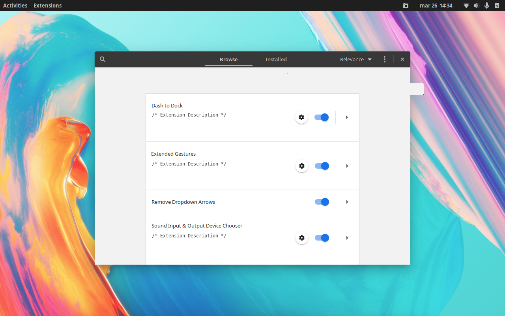
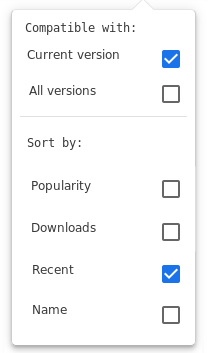
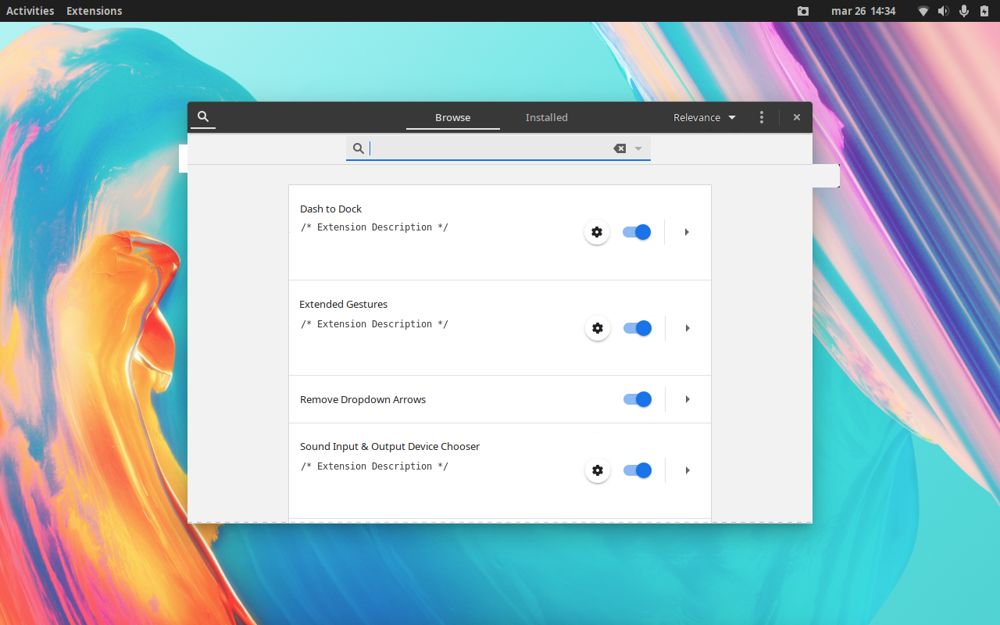
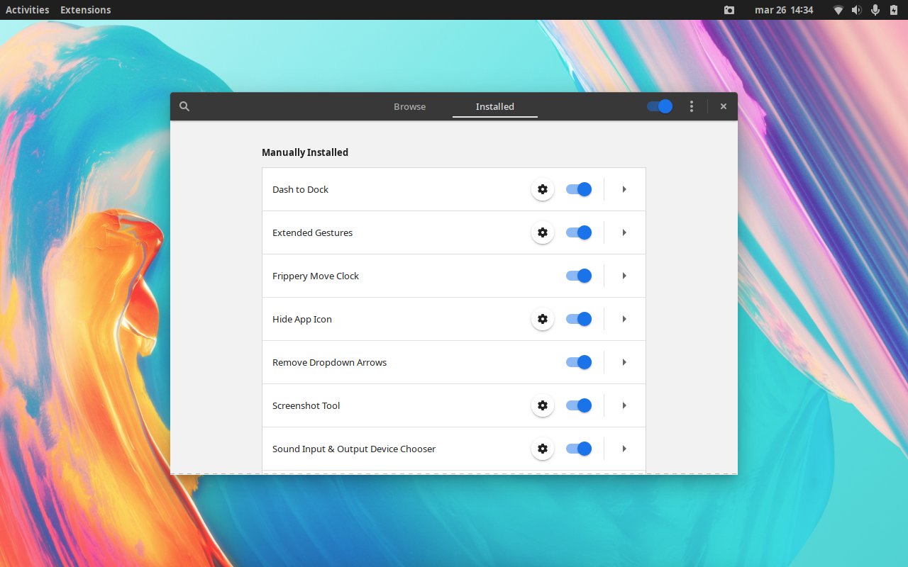

# extensions-store-mockup

Just a crude mockup of the extensions app in GNOME Shell 3.36 to show a possible online store in it. 

I used the Drawing app (https://github.com/maoschanz/drawing) to modify the screenshots with elements of the Pamac graphical package manager (https://gitlab.manjaro.org/applications/pamac) such as the search icons and bar, the headerbar tabs, extension order menu, and the general exposé layout of extensions and their description and options.

Yes, I know I should've used the Adwaita theme but the purpose of this showcase still stands, besides I was already half way through the editing when I remembered so out of sheer laziness I'm keeping the theme (https://github.com/nana-4/materia-theme) I was using which ended up helping due to its simpler design.

As you can see, there are some weird rendering glitches due to Drawing, I'll be sure to notify them.
The description should be shown under the extension title, if too big it can be expanded by the dropdown arrow toggle which should also show the info just like the local side does. However, an image or gif of the extensions funtion should be shown when expanded.

Notice the Relevance menu, doesn't make much sense to keep showing the on/off toggle of the local extensions in the online store section. In it I intend to unify the "sort by" and "compatibility" options shown in the web store into a "dropdown menu".
Edit: Maybe in the headerbar it should be called "Sort by" and not "Relevance", the latter should be in the menu where "Short by" is shown in the mockup.

Again, couple glitches, don't look at them, focus on the big picture. I'd prefer it if the search bar was in the headerbar and it expanded from the search icon but it could end up overlapping the tabs which would be a messy nightmare. Side note, since I based on the Pamac GUI I also think the same about it, massive waste of space coming from someone who's used the same 13' 16:10 1280 by 800 monitor for almost decade.

There's barely any change aside the headerbar, everything else is as it stands, the devs did a great job at splitting the built in and manually installed and all the functions once only available through the gnome extensions website.
